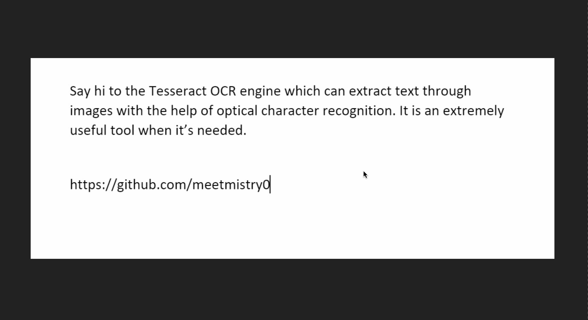

# Textract


Python script to extract text from images by using a fork of Google's tesseract OCR (Optical Character Recognition) engine.



## Prerequisites

### Git

Install git if you don't have it by going to https://git-scm.com/downloads
<br />

Scoop can also be used:

```
scoop install git
```

### Python

Install Python on your local machine by going to [Python's download section](https://www.python.org/downloads/)

### Alternative:

[Scoop](https://scoop.sh/)

```
scoop install python
```

#### Tesseract

Get the pytesseract installer from https://github.com/UB-Mannheim/tesseract/wiki

## Installing

#### Step-1

Install tesseract from the installer that you downloaded earlier. Note the path where the installer will install tesseract.<br />
If you use the default install directory, it should be:

```
C:\Program Files\Tesseract-OCR\tesseract.exe
```

Once the installer is finished, add the above directory (or the directory that you installed to) to the path.

#### If you changed the install directory of tesseract make sure to edit `pytesseract.pytesseract.tesseract_cmd` in the python file to your directory

#### Step-2

Git clone the repository by

```
git clone https://github.com/meetmistry0/Textract.git
```

#### Step-3

Install the required files for the script to run by pip installing the libraries in the requirement.txt
```
pip install -r requirements.txt
```

#### Or

```
pip install pyperclip
pip install PyQt5
pip install pytesseract
pip install py-notifier
pip install Pillow
```

#### Step-4

cd to the directory where you cloned the repository and use the following command to start the script

```
python textract.py
```

## Make the script executable

#### pyinstaller

```
pip install pyinstaller
```

### Creating exe

cd to the directory where the script is located and use the following command:

```
pyinstaller textract.py --onefile
```

### The executable will be in the dist folder.

<br />

### Shortcut for exe

Right click on the executable and create a shortcut and place it in:

```
C:\Users\YOUR_USERNAME\AppData\Roaming\Microsoft\Windows\Start Menu\Programs
```

### Enjoy :)
